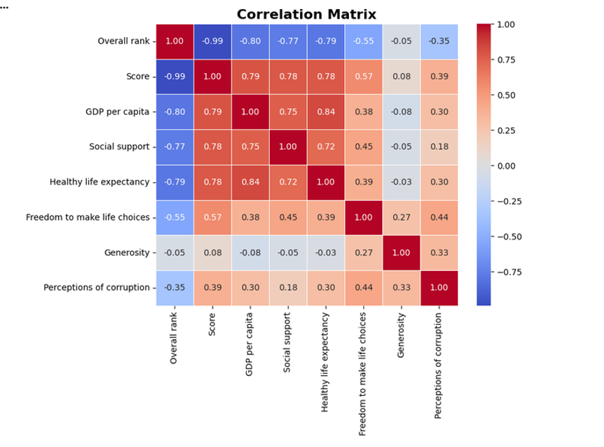
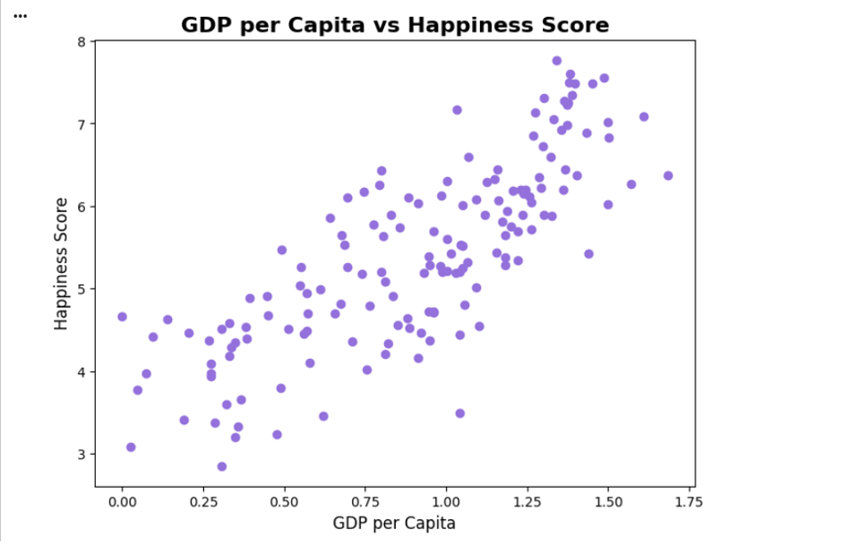

# World Happiness Analysis (Python)

This project explores the World Happiness dataset using Python. I created it to practise data cleaning, exploratory data analysis (EDA), and data visualisation while working with a real-world dataset.

Using Pandas, Matplotlib, and Seaborn, I analysed the relationship between happiness scores and factors such as GDP, social support, healthy life expectancy, and freedom to make life choices.

---

## Visualisations

### Top 10 Happiest Countries

### Correlation Heatmap

### GDP vs Happiness Score

---

## Dataset

The project uses the **World Happiness** dataset, which contains information about happiness scores and several factors that may influence them across different countries.

The data was cleaned and prepared before the analysis, including checking for missing values, reviewing data types, and removing unnecessary columns.

---

## Tools Used

- Python
- Pandas
- NumPy
- Matplotlib
- Seaborn
- Jupyter Notebook

---

## Project Files

- `World_Happiness_Analysis.ipynb`
- `data/world_happiness.xlsx`

---

## Key Findings

Some of the main insights from the analysis include:

- Countries with higher GDP generally reported higher happiness scores.
- Social support showed a strong positive relationship with happiness.
- Healthy life expectancy was also closely linked to happiness.
- The correlation heatmap made it easier to compare the relationships between all variables.

---

## What I Learned

This project helped me become more confident using Python for data analysis.

The biggest challenge was exploring the relationships between different variables and deciding which charts would communicate the results most clearly. It also gave me more practice using Pandas to clean data and Matplotlib and Seaborn to create visualisations.

By completing this project, I became more comfortable analysing datasets and presenting insights through clear and informative charts.

---

## Skills Demonstrated

- Data cleaning
- Exploratory Data Analysis (EDA)
- Data visualisation
- Statistical analysis
- Pandas
- NumPy
- Matplotlib
- Seaborn

---

## Author

**Wioletta Zajac**
